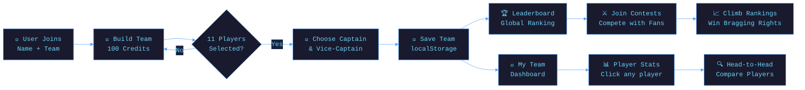

<!-- ═══════════ ANIMATED HEADER ═══════════ -->

# 🏏 IPL Fantasy

<div align="center">
<!-- ═══════════ TYPING ANIMATION ═══════════ -->
[](https://git.io/typing-svg)
<br/>

<!-- ═══════════ BADGES ═══════════ -->

&nbsp;

&nbsp;

&nbsp;

&nbsp;


<br/>


&nbsp;

&nbsp;

&nbsp;

&nbsp;


</div>

---

## 🏏 What is IPL Fantasy?

**IPL Fantasy** is a premium, modern fantasy cricket platform that lets you build your dream XI from 10 IPL teams within a 100-credit budget. Choose your Captain & Vice-Captain, save your team to the global leaderboard, compete in contests, and analyze real IPL player stats with detailed modals and head-to-head comparisons.

Built with **Next.js 16**, **TypeScript**, **Tailwind CSS 4**, and **shadcn/ui** — featuring a clean white-themed design, smooth Framer Motion animations, and persistent localStorage-based authentication (no email, no password required).

> *"Pick. Strategize. Compete. — The ultimate cricket fantasy experience."*

### ✨ Core Philosophy
- 🎯 **Simplicity first** — name-only sign-up, zero friction
- ⚡ **Real-time feedback** — instant budget tracking & team validation
- 🔌 **Persistent** — your team stays saved across sessions
- 📊 **Data-rich** — 60+ real IPL players with full stats

---

## 🚀 Features

<div align="center">

| Feature | Description | Status |
|---------|-------------|--------|
| 🏏 **Team Builder** | Build your fantasy XI within 100-credit budget (max 7 per team) | ✅ Active |
| 👑 **Captain & Vice-Captain** | Captain (2x points) & Vice-Captain (1.5x points) selection | ✅ Active |
| 🔐 **Simple Authentication** | Name + team name only — no email, no password | ✅ Active |
| 💾 **Persistent Team Saving** | Team saved to localStorage & appears on leaderboard | ✅ Active |
| 👤 **My Team Dashboard** | Full team view with captain, roles, distribution & stats | ✅ Active |
| 📊 **Player Detail Modal** | Click any player for full stats + form chart + progression | ✅ Active |
| ⚔️ **Head-to-Head Compare** | Compare any two players side-by-side with winner highlighting | ✅ Active |
| 🏆 **Live Leaderboard** | Top-3 podium + full rankings with trend arrows (up/down) | ✅ Active |
| 📅 **Real IPL 2026 Schedule** | 74 matches with dates, venues, scores, Player of the Match | ✅ Active |
| 🌟 **IPL 2027 Coming Soon** | Calendar-not-released notice with expected start | ✅ Active |
| 🎫 **Contests Section** | 6 contests (Mega, RCB Fan, Beginner's, Head-to-Head, etc.) | ✅ Active |
| 📋 **Standings + Point System** | Full points table with NRR + Fantasy point rules | ✅ Active |

</div>

---

## 🛠️ Tech Stack

<div align="center">

### ⚛️ Framework & Language


### 🎨 Styling & UI


### 🔧 Tools & DevOps


### 🗄️ State & Storage


</div>

---

## 🗂️ Project Structure

```
📦 ipl-fantasy/
├── 📁 src/
│   ├── 📁 app/
│   │   ├── 📄 layout.tsx          ← Root layout (AuthProvider, fonts, metadata)
│   │   ├── 📄 page.tsx            ← Main page (7 sections + 3 modals)
│   │   ├── 📄 globals.css        ← Tailwind global styles
│   │   └── 📁 api/                ← Next.js API routes
│   ├── 📁 components/
│   │   ├── 📁 ui/                 ← shadcn/ui components (50+ files)
│   │   └── 📄 toaster.tsx         ← Toast notification component
│   ├── 📁 hooks/
│   │   └── 📄 use-toast.ts        ← Toast hook
│   └── 📁 lib/
│       └── 📁 ipl/
│           ├── 📄 teams.ts        ← 10 IPL teams with brand colors
│           ├── 📄 players.ts      ← 60+ real IPL players with stats
│           ├── 📄 matches.ts      ← 74 IPL 2026 matches + 2027 status
│           └── 📄 auth.tsx        ← React Context for auth & saved teams
├── 📁 prisma/                     ← Prisma schema (if needed)
├── 📁 public/                     ← Static assets
├── 📄 next.config.ts              ← Next.js configuration
├── 📄 tailwind.config.ts          ← Tailwind CSS configuration
├── 📄 tsconfig.json               ← TypeScript configuration
├── 📄 package.json                ← Dependencies & scripts
└── 📖 README.md                   ← Project documentation
```

---

## ⚙️ Architecture Overview



---

## 🚦 Quick Start

### Prerequisites

```bash
# Make sure you have Node.js 18+ and Bun installed
node --version    # v18 or higher
bun --version     # v1.0 or higher

# (Optional) If you don't have Bun, install it
curl -fsSL https://bun.sh/install | bash
```

### 🖥️ Run Locally

```bash
# 1. Clone the repository
git clone https://github.com/shabadgrover/ipl-fantasy.git

# 2. Navigate to the project directory
cd ipl-fantasy

# 3. Install dependencies
bun install

# 4. Start the development server
bun run dev

# 5. Open in your browser
# → http://localhost:3000
```

### 📦 Build for Production

```bash
# Create an optimized production build
bun run build

# Start the production server
bun run start
```

---

## 🎮 How to Use

<div align="center">

```
  Step 1             Step 2              Step 3              Step 4
     🔐                 🏏                  👑                  🏆
Join League   →   Build Fantasy XI   →  Set Captain & VC  →  Compete & Win
 Just a Name        100 Credits         2x / 1.5x Boost       Leaderboard
```

</div>

### 🗣️ Example User Flow

| Action | Result |
|---------|--------|
| **Click "Join"** | Opens sign-up modal — enter name + team name |
| **Go to "Build Team"** | Pick 11 players within 100-credit budget |
| **Select Captain** | Captain gets 2x fantasy points multiplier |
| **Select Vice-Captain** | Vice-Captain gets 1.5x multiplier |
| **Click "Save & Join Contest"** | Team saved to localStorage + joins leaderboard |
| **View "My Team"** | Full dashboard with squad, captain, role composition |
| **Click any player** | Opens detailed stats modal with form chart |
| **Click "Compare"** | Compare two players side-by-side |
| **Visit "Contests"** | Join free contests (Mega, RCB Fan, etc.) |
| **Check "Leaderboard"** | See your rank vs thousands of fans |

---

## 📸 Interface Preview

<div align="center">

> ⚪ **Clean white-themed modern UI** — minimal, professional, and fast

```
┌──────────────────────────────────────────────────────┐
│  🏏 IPL FANTASY                          PREMIUM     │
│  ─────────────────────────────────────────────────── │
│  Home | Build Team | My Team | Players | Schedule    │
│        | Standings | Leaderboard | Contests          │
├──────────────────────────────────────────────────────┤
│                                                      │
│   Build Your Dream                                   │
│   🟠 Cricket Dynasty 🟠                              │
│                                                      │
│   [ 🏏 Build Your Team ]  [ 🏆 View Leaderboard ]    │
│                                                      │
│   📊 180+ Players   📅 74 Matches   🏆 10 Teams     │
│                                                      │
└──────────────────────────────────────────────────────┘
```

**Background:** `#FFFFFF` &nbsp;|&nbsp; **Primary:** `#F953C6` &nbsp;|&nbsp; **Accent:** `#FF6F00` &nbsp;|&nbsp; **Text:** `#0F172A`

</div>

---

## 🔬 Core Components

The application is built as a single-page app with 7 sections + 3 modals:

```typescript
// 1. Auth Context (src/lib/ipl/auth.tsx)
interface User {
  name: string;
  teamName: string;
  joinedAt: number;
}

interface UserTeam {
  owner: string;
  teamName: string;
  totalPoints: number;
  weekPoints: number;
  captain: string;
  players: Player[];
}

// 2. Team Builder State
const [selected, setSelected] = useState<string[]>([]);
const [captain, setCaptain] = useState<string | null>(null);
const [viceCaptain, setViceCaptain] = useState<string | null>(null);

// 3. Save team to leaderboard
function handleSaveTeam() {
  if (selected.length !== 11) return;
  const userTeam: UserTeam = {
    owner: user.name,
    teamName: teamName,
    captain: cap.name,
    players: selectedPlayers,
    totalPoints: Math.round(totalPts),
  };
  saveTeam(userTeam); // Persists to localStorage + leaderboard
}
```

---

## 🎯 Key Features in Detail

### 🏏 Team Builder
- **100-credit budget** — manage your squad within limit
- **Max 7 players per team** — realistic fantasy rule
- **Role validation** — auto-track WK/Batsman/Bowler/All-Rounder counts
- **Real-time form indicators** — last 5 matches performance bars
- **Toast notifications** — instant feedback on squad/budget violations

### 👤 Player Detail Modal
- Full stats: matches, runs, wickets, average, strike rate, economy
- Fantasy stats: total points, selection %, average per match
- **Form visualization** — color-coded bar chart for last 5 matches
- **Season progression** — 10-match performance chart
- Top Pick badge for elite performers

### ⚔️ Head-to-Head Comparison
- Pick any 2 players from 60+ database
- Side-by-side comparison across 9 stats
- **Winner highlighting** — green for better stat
- Swap & Clear buttons for quick resets

### 🏆 Leaderboard
- **Top-3 podium** — gold/silver/bronze cards with crowns/medals
- User's team marked with **"YOU"** badge
- Trend arrows (↑ ↓ −) showing rank progression
- Expandable squad view — click any team to see their XI

---

## 🤝 Contributing

Contributions are what make the open-source community amazing! Here's how you can help:

```bash
# 1. Fork the repository on GitHub
# 2. Create your feature branch
git checkout -b feature/AmazingFeature

# 3. Commit your changes
git commit -m '✨ Add AmazingFeature'

# 4. Push to the branch
git push origin feature/AmazingFeature

# 5. Open a Pull Request 🎉
```

### 💡 Ideas for Contribution
- [ ] 🌙 Dark mode toggle
- [ ] 🌍 Multi-language support (Hindi, Tamil, Bengali)
- [ ] 📱 Mobile app version (React Native)
- [ ] 🧠 AI-powered team recommendations
- [ ] 📊 Live match score integration (real-time API)
- [ ] 🔐 Optional email-based persistent accounts
- [ ] 💬 Friend system & private contests
- [ ] 🎨 Multiple theme options (team-based skins)

---

## 📜 License

Distributed under the **MIT License**. See [`LICENSE`](LICENSE) for more information.

---

## 👨‍💻 Author

<div align="center">

### **Umang Pandey**
*Python Developer · Data Analyst · ML Engineer*

[](mailto:umangpandey.co@gmail.com)
&nbsp;
[](https://linkedin.com/in/umang-pandey-01b486273)
&nbsp;
[](https://github.com/Umangpandey75)
&nbsp;
[](https://umangpandey.vercel.app)

*"Pick the players. Build the strategy. Ship the WIN. 🏏"*

</div>

---

## ⭐ Show Your Support

If **IPL Fantasy** helped you or you enjoyed using it, please give it a ⭐ — it means the world!

<div align="center">

[](https://github.com/shabadgrover/ipl-fantasy/stargazers)
&nbsp;
[](https://github.com/shabadgrover/ipl-fantasy/fork)
&nbsp;
[](https://twitter.com/intent/tweet?text=Check+out+IPL+Fantasy+by+%40Umangpandey75!+%F0%9F%8F%8F%E2%9A%94%EF%B8%8F&url=https://github.com/shabadgrover/ipl-fantasy)

</div>

---
<!-- ═══════════ FOOTER WAVE ═══════════ -->


<div align="center">

*Made with ❤️ by [Umang Pandey](https://github.com/Umangpandey75) · © 2026 IPL Fantasy*


</div>
